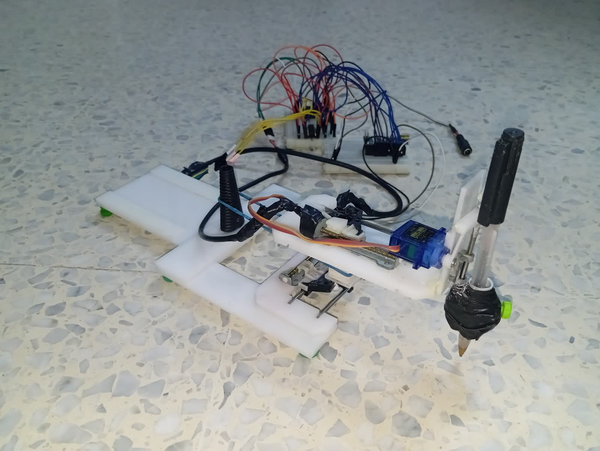
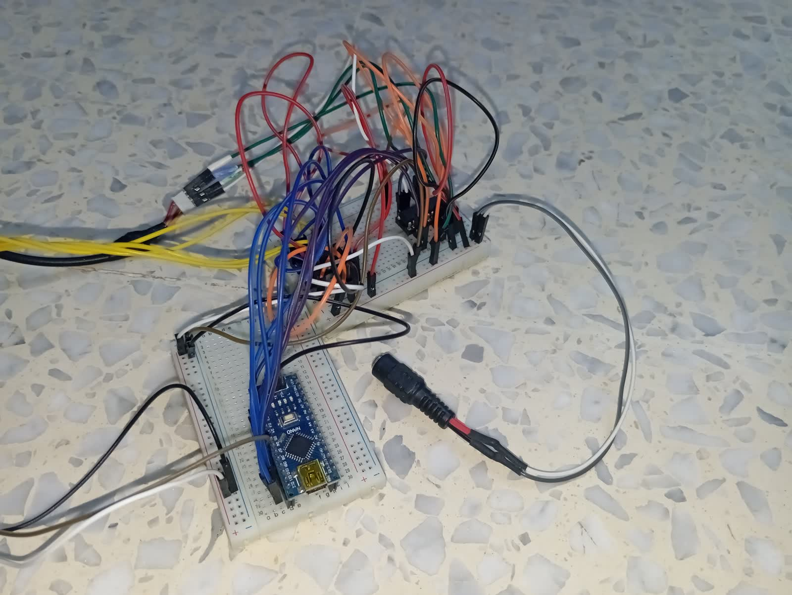
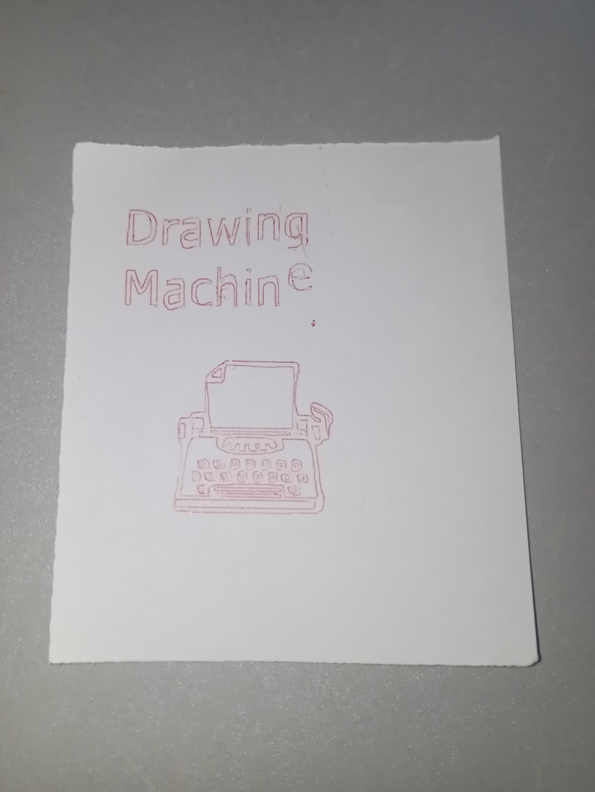

# DIY Drawing Machine

Un traceur XY artisanal qui reproduit sur papier des dessins décrits en G-code.

## Fonctionnement

Un sketch Processing envoie les instructions G-code par liaison série à un Arduino Nano. Le firmware pilote deux moteurs pas-à-pas pour les déplacements X/Y et un servo qui lève ou baisse le stylo. Les commandes et limites utilisées sont adaptées à cette machine.

## Matériel visible et confirmé

- Arduino Nano
- Plaque d'essai et fils Dupont
- Deux axes entraînés par des moteurs pas-à-pas, d'après le firmware
- Servo utilisé pour le stylo, d'après le firmware

Les modèles des moteurs, du servo et du circuit de commande ne sont pas établis par les éléments disponibles.

## Câblage photographié

## Exemple de dessin

## Démonstration

▶️ [Voir la démo](video/demo.mp4)

## Réglages comparés

Valeurs relevées dans les sources locales et dans les versions TinyCNC/gctrl consultées. Les dimensions sont des limites configurées, pas une mesure garantie de la course mécanique.

| Paramètre | TinyCNC / gctrl d'origine | Version locale comparée |
|---|---|---|
| Broches | Servos X/Y/Z : 11/10/9 | Moteur Y : 2, 3, 4, 5; moteur X : 8, 9, 10, 11; servo du stylo : 6 |
| Pas par mm | Non applicable aux axes d'origine à servos | X : 6,92 pas/mm; Y : 6,90 pas/mm |
| Angles des servos | X : 17-171°; Y : 25-146°; Z : 18-50° | Stylo levé : 60°; stylo baissé : 0° |
| Vitesse des axes | Axes à servos; pas de vitesse en tr/min (`StepDelay` : 0 ms) | Moteurs pas-à-pas X/Y : 50 tr/min chacun |
| Zone configurée | X : environ 8,31-83,57 mm; Y : environ 12,22-71,35 mm | X : 0-26 mm; Y : 0-29 mm |
| Pas de déplacement manuel | 0,001 / 0,01 / 0,1 pouce | 0,5 / 1 / 2 mm |
| Débit série | Firmware TinyCNC : 115200 bauds; gctrl : 9600 bauds | Firmware et Processing : 9600 bauds |

Les limites d'origine en millimètres sont les conversions commentées dans TinyCNC; elles ne sont pas directement comparables aux limites de course mesurées sur la machine actuelle.

## Crédits et sources

Le firmware utilisé est dérivé de [TinyCNC-Sketches](https://github.com/MakerBlock/TinyCNC-Sketches). Le sketch Processing est dérivé de [gctrl](https://github.com/damellis/gctrl). Ces projets ne fournissent pas de licence dans les dépôts consultés; leurs sources ne sont donc pas redistribuées ici. Aucun fichier `LICENSE` n'est ajouté.
